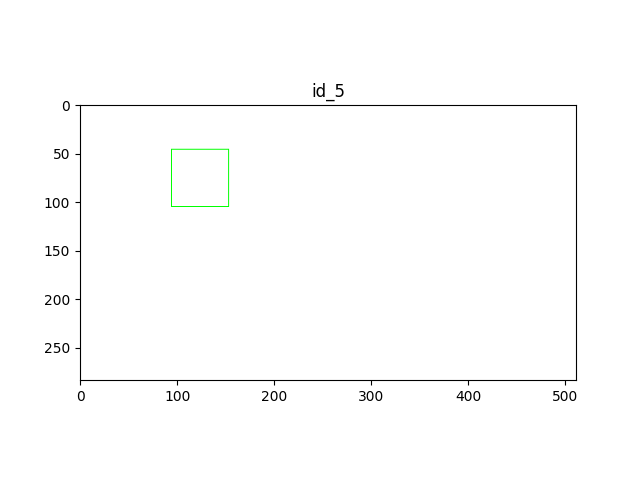

# 例子
假设现在数据集中一共有5张图片，①第1张图片中有2个A类别的gt，有三个A类别的预测框，score分别为(0.3, 0.5, 0.9)，按照上述计算TP的方法(按score从大到小的顺序匹配)发现score为0.3和0.9的与gt相匹配，则将这两个记为TP。建立用于计算PR曲线的数组metric和记录A类别gt总数的变量ngt，向数组中加入(0.3, 1), (0.5, 0), (0.9, 1)三组数据（每组数据的第一个代表预测框的score，第二个代表这个预测框是否是TP），并将n_gt累加3；使用相同的方法计算接下来的几张图片，②第2张图片中没有A类别的物体(gt数量为0)，则n_gt+=0，但有一个关于A类别的预测框，score为0.45，则向metric中加入(0.45, 0)；③第3张图片中有1个A类别的物体，但没有预测框，则n_gt+=1；④第4张图片中有3个A类别的物体，有5个预测框，其中有3个与gt相匹配，最终n_gt+=3，metric中加入(0.85, 1), (0.8, 1), (0.7, 1), (0.35, 0), (0.1, 0)；⑤第5张图片中没有A类别的物体，也没有A类别的预测框。

最终将得到的A类别的n_gt=6，metric按score值从大到小进行排序为(0.9, 1), (0.85, 1), (0.8, 1), (0.7, 1), (0.5, 0), (0.45, 0), (0.35, 0), (0.3, 1), (0.1, 0) 共9个预测框，也就是可以得到9组PR值，先计算所有的预测框(score阈值设置为0)，得到Precision为5/9、Recall为5/6，然后依次去掉metric中最后一组数据，可以得到(5/8, 5/6), (4/7, 4/6), (4/6, 4/6), (4/5, 4/6), (4/4, 4/6), (3/3, 3/6), (2/2, 2/6), (1/1, 1/6) 共9组PR值。

观察上述PR值的规律会发现，随着score的阈值的增大，预测框总数会一直减小，而TP却会有时保持不变，有时变小，所以会出现同一Recall对应多组Precision的情况。最终在计算AP时，我们只需要取每个Recall值对应的最大Precision进行计算即可。因为A类别一共有6个gt，所以Recall的值应该是从1/6~6/6共6个，也就是要取6组PR值计算平均Precision，因为这个例子中没有出现Recall=6/6的情况，所以R=6/6时的Precision算作0，即类别A的AP=(1/1 + 2/2 + 3/3 + 4/4+ 5/8 + 0) / 6 = 0.7708。按照同样的方式计算其他类别的AP，最后求所有AP的均值，即可得到mAP。

> 例子及解答来自[这儿](https://zhuanlan.zhihu.com/p/94597205)，更多概念请查看这个知乎回答

# bbox

# PR Curve

